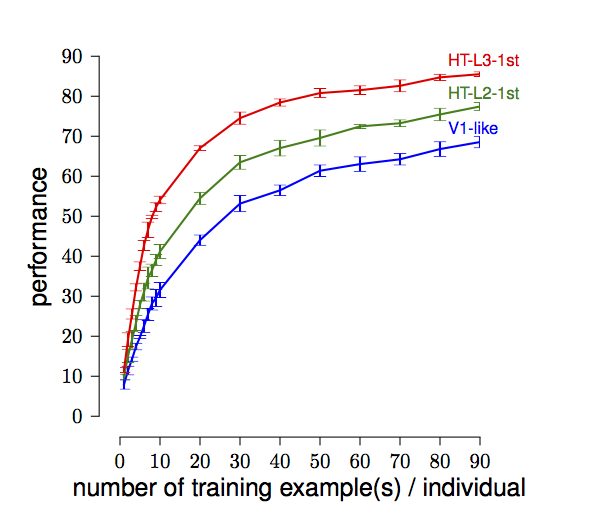
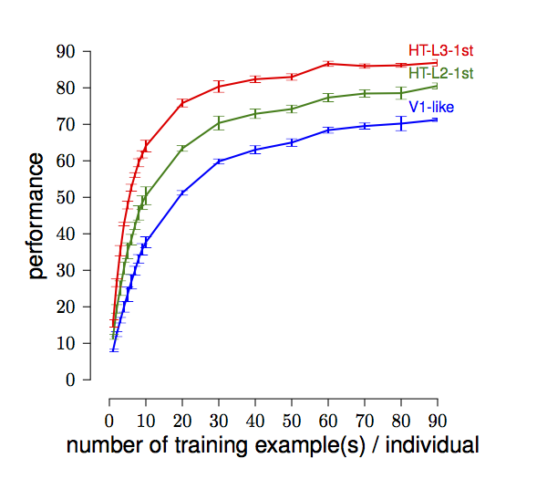

This is a mirror of [PubFig83: A resource for studying face recognition in personal photo collections](https://vision.seas.harvard.edu/pubfig83/)

It comprises a downloadable dataset of 8300 cropped facial images, made up of 100 images for each of 83 public figures. It was derived from the list of URLs compiled by Neeraj Kumar et al and has been screened to remove near-duplicate images. It can be used as a proxy for the problem of recognizing identities from near-frontal faces in personal photo collections.

## Comparison to Facebook images

How well does identification performance on the PubFig83 dataset approximate performance on personal photo collections in Facebook? The top graph shows the accuracy of three different identification systems on an 83-way identification task using PubFig83, as a function of the number of training samples for each individual. The bottom graph shows the accuracy of the very same systems on a 100-way identification task using a comparable dataset harvested from Facebook. (The identification systems are one-vs-all linear SVMs with descriptors from one-layer, two-layer, and three-layer convolutional neural networks. See the paper.)

## Misc

If you're looking for `pubfig83_errata.txt` (1KB) containing a list of images in the database that are known to appear mis-cropped, mis-identified, or questionable in some way, got to the [official pages](https://vision.seas.harvard.edu/pubfig83/)

If you're looking for `pubfig83_with_L3_Prime_descriptors.tgz` (2.9GB) containing facial image files and the corresponding L3 descriptors used in the graphs above, go to the [official pages](https://vision.seas.harvard.edu/pubfig83/)

## Citation
If you use this resource in a publication, please cite:

Nicolas Pinto, Zak Stone, Todd Zickler, and David D. Cox, "Scaling Up Biologically-Inspired Computer Vision: A Case Study in Unconstrained Face Recognition on Facebook", Proc. Workshop on Biologically Consistent Vision (in conjunction with CVPR), 2011. [[pdf]](https://vision.seas.harvard.edu/pubfig83/ScalingFaceRec_WBCV2011.pdf)